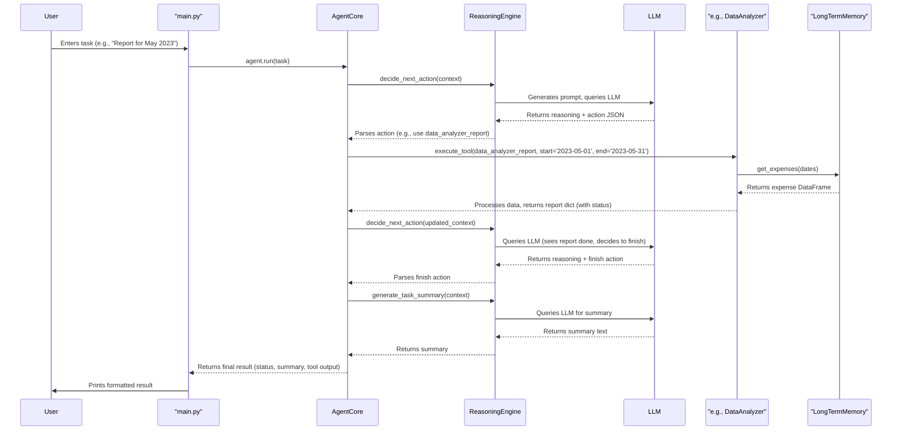

**Video Demo:** 

## Problem Solved

Managing personal finances often involves tedious tasks like categorizing transactions, tracking spending against budgets, monitoring savings goals, and analyzing historical data for insights. This agent aims to automate these processes by:

1.  Ingesting transaction data from a CSV file.
2.  Automatically categorizing transactions (initially during loading, potentially refined by user interaction).
3.  Allowing users to set and manage budgets and financial goals through natural language commands.
4.  Providing spending analysis reports and budget status updates.
5.  Maintaining persistent memory of financial data, budgets, and goals across sessions.

## Features & Capabilities

*   **Autonomous Reasoning:** Uses a ReAct-style reasoning loop (`agent/reasoning.py`) to understand user tasks, select appropriate tools, and decide on next steps. Interacts with Google's Gemini LLM via `utils/llm_utils.py`.
*   **Tool Use:** Equipped with a suite of specialized Python tools:
    *   `LongTermMemory`: Persists financial data (`expenses.csv`), rules (`categories_rules.json`), budgets (`budget.json`), and goals (`goals.csv`) in the `data/` directory.
    *   `CategoryManager`: Manages spending categories and rules for transaction categorization (uses LLM for hybrid approach).
    *   `BudgetAdvisor`: Sets income, manages category budgets, calculates budget status, and generates spending recommendations (interacts with LTM).
    *   `DataAnalyzer`: Processes historical expense data from LTM to generate reports on spending summaries, category breakdowns, trends, and anomalies.
    *   `GoalTracker`: Creates, updates, tracks progress, lists, and projects financial goals.
    *   `SelfImprovementEngine` (Basic): Analyzes errors stored in LTM to suggest potential improvements (exposed as a tool).
*   **Memory:**
    *   **Short-Term:** Uses an in-memory list (`memory/short_term.py`) within the `FinancialAgent` to hold context for the current task execution.
    *   **Long-Term:** Utilizes the `LongTermMemory` class (`memory/long_term.py`) to save and load financial data, configurations, and goals to/from files in the `data/` directory, ensuring persistence.
*   **Data Loading & Initial Categorization:** The `main.py` script includes logic (`load_expenses_from_csv`) to read transaction data from a specified CSV format and perform initial categorization using the `CategoryManager`'s rules upon startup.
*   **Interactive CLI:** Provides a command-line interface for users to interact with the agent using natural language.
*   **Error Handling:** Includes basic error handling for tool execution and attempts LLM-driven recovery for some failures. Enhanced error reporting from tools aids reasoning.

## System Architecture

The system follows a modular design:

1.  **`main.py`**: The entry point. Initializes all components, loads initial transaction data using `load_expenses_from_csv`, registers tools with the agent, and runs the main interactive command loop.
2.  **`agent/core.py` (`FinancialAgent`)**: The central orchestrator. Manages the agent's state, holds references to tools and memory components, executes the main run loop (decide -> act), handles tool execution calls, and manages short-term memory.
3.  **`agent/reasoning.py` (`ReasoningEngine`)**: Handles the "thinking" part. Receives context from the agent core, formats prompts using predefined templates, interacts with the LLM (`LLMManager`) to decide the next action or handle failures, and parses the LLM response.
4.  **`utils/llm_utils.py` (`LLMManager`)**: A dedicated interface for communicating with the Google Gemini API, managing API keys, and handling basic query/response logic.
5.  **`memory/`**:
    *   `long_term.py` (`LongTermMemory`): Manages persistent storage using files (CSV, JSON). Provides methods for adding, retrieving, updating, and deleting financial records (expenses, goals, budgets, preferences, rules).
    *   `short_term.py` (`ShortTermMemory`): Simple volatile list for holding recent actions and results during a single task execution.
6.  **`tools/`**: Contains individual Python modules, each responsible for a specific financial domain (budgeting, categorization, analysis, goal tracking). These modules typically interact with `LongTermMemory` to access or modify persistent data.
7.  **`data/`**: The directory where all persistent data files are stored. This includes the *processed* `expenses.csv` (generated by `load_expenses_from_csv`), `categories_rules.json`, `budget.json`, and `goals.csv`. The *raw* input transaction file is expected in `data/transactions/`.


**Workflow Example:**



##Technologies Used

- **Python 3.9+**
- **Pandas**: For data manipulation, especially reading CSVs and handling expense data.
- **google-generativeai**: Python SDK for Google Gemini API.
- **python-dotenv**: For managing environment variables (API keys).
- **Standard Libraries**: `os`, `json`, `logging`, `time`, `datetime`, `re`, `hashlib`.


# Setup Instructions

## Clone the Repository

```bash
git clone 'ahsan3274/financial-agent'
cd financial-agent

##Create a Virtual Environment
```bash
python -m venv venv
# Activate it:
# Windows: venv\Scripts\activate
# macOS/Linux: source venv/bin/activate
```

## Install Dependencies
```bash
pip install -r requirements.txt

```

## Set Up Environment Variables
-Create a file named .env in the root directory of the project.

-Add your Google Gemini API key to the .env file:

```bash

GOOGLE_API_KEY=YOUR_API_KEY_HERE

```


# Prepare Transaction Data
-Create the directory structure data/transactions/.

-Place your transaction data CSV file inside data/transactions/. Let's assume its name is my_transactions.csv.
This file should have columns like Posting date, Amount, Payee, Payment Method, Category (or headers matching your bank statement format).

-IMPORTANT:
Open main.py and find the line where raw_transactions_csv_path = os.path.join(...).
Update the filename part to match your CSV file name (e.g., my_transactions.csv, bank_statement.csv, or synthetic_expenses.csv).
Ensure the column names defined within the load_expenses_from_csv function in main.py exactly match the headers in your CSV file.
Adjust dayfirst=True/False in pd.read_csv depending on your date format (DD/MM/YYYY vs MM/DD/YYYY).

# Usage

-Navigate to the project's root directory in your terminal.

-Ensure your virtual environment is activated (if you created one).

-Run the main script:

```bash
python main.py
```
-The agent will initialize, load data from your CSV, and present a > prompt.

-Enter your financial tasks in natural language. Example commands:

    -Set my monthly income to 4000 EUR

    -Set budget for Transportation to 150

    -Generate a spending report for last month

    -How much did I spend on Groceries in February 2024?

    -Create a goal: Save for vacation, target $2000, due 2025-12-01

    -Update progress on goal GOAL-1 to $500 (Find the actual goal ID first using List active goals)

    -List active goals

    -What is my budget status for this month?

-Type quit or exit to shut down the agent gracefully (this saves the latest state).
# AI Tool Reflection

During the development of this financial agent, AI assistance was utilized in several capacities, primarily leveraging Google Gemini (via the API for the agent's core reasoning) and potentially other LLM assistance (like ChatGPT or GitHub Copilot, if applicable) for specific development tasks.

1. Core Agent Reasoning & Prompt Engineering:
The agent's ability to understand tasks and select tools relies heavily on the LLM prompts defined in the ReasoningEngine. AI assistance was used to:
* Draft initial versions of the ReAct-style reasoning prompts.
* Brainstorm the step-by-step thinking process outlined in the prompts.
* Refine prompts based on observed agent behavior – for example, adding explicit instructions to consider past errors when the agent initially kept retrying failed actions inappropriately. Iteration was key here, guided by testing results.

2. Code Generation & Boilerplate:
AI suggestions (e.g., from Copilot or by asking an LLM) occasionally served as a starting point for:
* Standard functions like file reading/writing boilerplate, particularly the initial structure for loading and parsing the CSV data (load_expenses_from_csv).
* Basic class structures or utility function implementations.
* Crucially, all generated code required review, modification, and integration into the existing system architecture.

3. Debugging Assistance:
When encountering errors, especially:
* Pandas library errors related to data manipulation (e.g., the AttributeError: 'Series' object has no attribute 'strftime' or the ValueError: Invalid frequency: DS).
* Cryptic API errors (like the 429 Rate Limit errors).
* Python syntax or logic errors (NameError, etc.).
Pasting the error message and relevant code snippet into an LLM often provided helpful explanations of the cause or suggested potential fixes, significantly speeding up the debugging process compared to solely relying on documentation searches. Understanding why the fix worked still required developer analysis.

4. Concept Exploration & Logic:
During the design phase, querying an LLM helped explore different ways to structure:
* The error handling logic within tools (like returning a status dictionary from DataAnalyzer).
* Methods for generating descriptions from multiple CSV columns.


5. Documentation:
Assistance was used minimally for refining docstrings/rephrasing explanations within comments / this README for clarity / function skeletons

# Challenges & Limitations Encountered with AI:

    -Initial Tool Selection: Early versions of the reasoning prompts led to the LLM frequently selecting incorrect tools (e.g., goal_tracker for a budget task). This required making tool descriptions much more distinct and explicitly guiding the LLM's reasoning process within the prompt.

    -Output Formatting: The LLM did not always adhere strictly to the requested JSON format for actions, necessitating robust JSON extraction and parsing logic (including handling incomplete or malformed JSON) in the ReasoningEngine.

    -Rate Limiting: The 429 errors from the free-tier API were a major practical hurdle, forcing the implementation of artificial time.sleep() delays, which impacts usability and demonstrates a key operational constraint.

    -Contextual Understanding: While generally good, the LLM sometimes missed nuances in the short-term memory or failed to adequately incorporate error messages into its subsequent reasoning without explicit prompting instructions.

# Future Extensions & Considerations

    -More Sophisticated Reasoning: Add task decomposition into sub-tasks.

    -Enhanced Error Handling: Implement smarter retry or fallback mechanisms.

    -Context Management: Improve memory search and summarization.

    -Data Visualization Tool: Generate simple charts using Matplotlib or Seaborn.